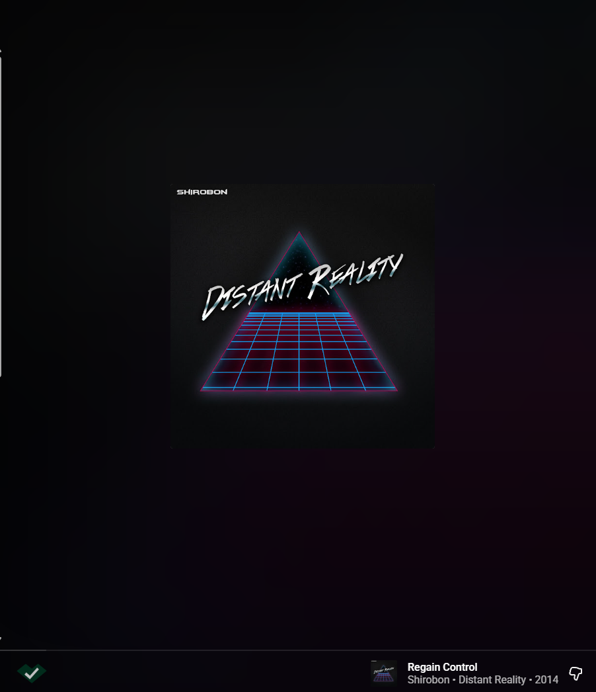

# Check [SoulOverAi](https://souloverai.com/list) automatically 

A bare-bones Chrome extension that watches your music streaming platform of choice to tell you whether the song you’re listening to was made by a human or a data center.

It automatically checks the current track against SoulOverAI's list

## Supports: Spotify, YouTube Music, SoundCloud, Apple Music

Very basic right now, much to be improved!

Messy code made by hand!... because having AI make it would go against the whole point wouldnt it?

