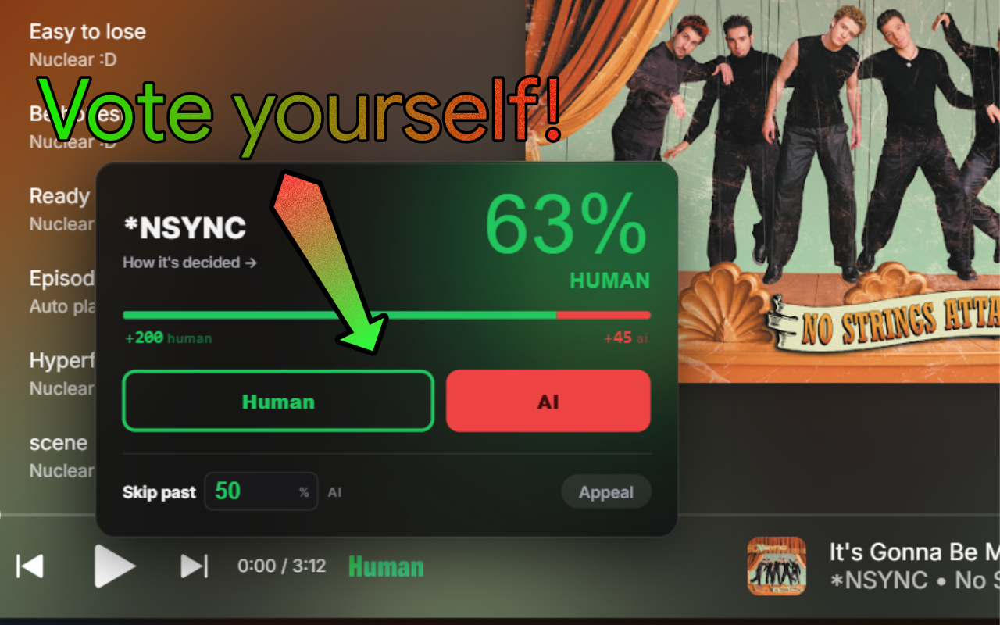

# SoundProof - Detect, skip, and vote. a community-powered AI music blocklist

## Don't want to worry about staying up to date? [Get it on the Chrome store!](https://chromewebstore.google.com/detail/detect-skip-ai-music-soul/mbfhdilbcdcnhbaakndiofeahchaclpa?authuser=0&hl=en)
(I would greatly appreciate the ego boost of getting a download on the web store, too!)

> [!IMPORTANT]
> If you are here because you are an artist/fan who feels unfairly blocked, you're in luck! [appeal here!](https://github.com/NuclearBlox/SoundProof-extension/wiki/Appealing-an-incorrect-rating)

> [!WARNING]
> This build is in beta! Things will change and may break. report back to me!

A Chrome extension that watches your music streaming platform of choice to tell you whether the song you’re listening to was made by a human or a data center.

It automatically checks the current track against SlopCall, an API built specifically for this extension

## Supports: Spotify, YouTube Music, SoundCloud, Apple Music

Very basic right now, much to be improved!

(thanks to [Fudge21](https://github.com/fudge21) for Apple music support!...which is broken right now)

