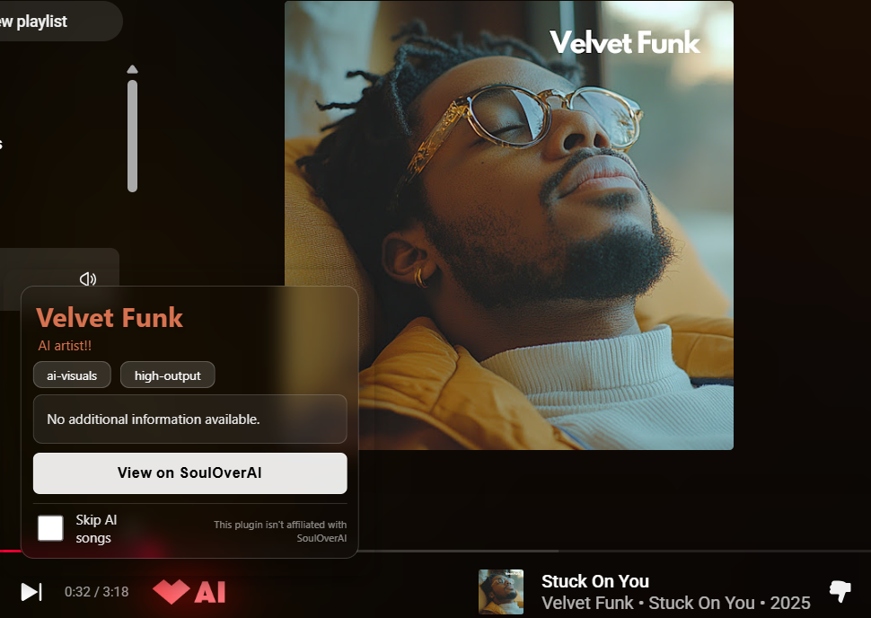
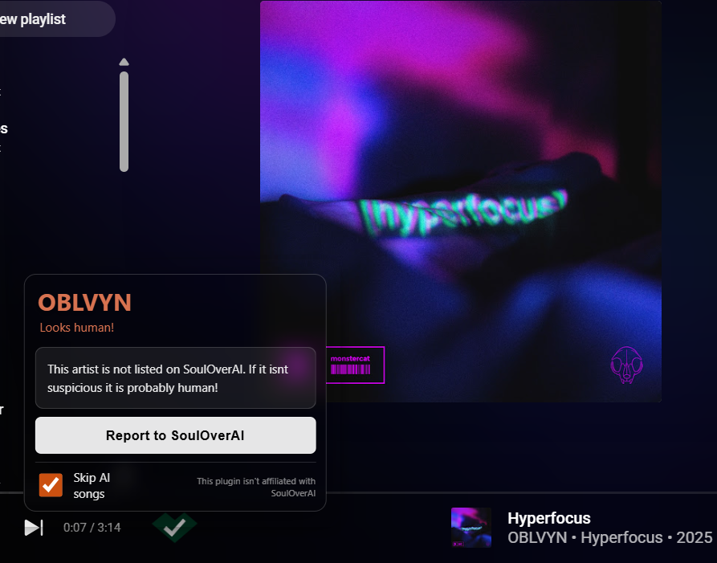

# Check [SoulOverAi](https://souloverai.com/list) automatically 

## Don't want to worry about staying up to date? [Get it on the Chrome store!](https://chromewebstore.google.com/detail/detect-skip-ai-music-soul/mbfhdilbcdcnhbaakndiofeahchaclpa?authuser=0&hl=en)
(I would greatly appreciate the ego boost of getting a download on the web store, too!)

> [!important]
> New dataset is done i just need to link it to the client in a nice way! The extension will be moving to a custom dataset made specifically for this extension. Using votes to mark AI instead of relying on one overworked persons dataset. see you soon!

> [!note]
> SoulOver AI is being abandoned. The extension still works. The datasource is no longer being updated. I am working on finding a new datasource and creating a block list. The extension most likely will undergo some changes; a user shouldn't notice them, but I can't promise anything. You may notice a rebrand, though!

## ~ℹ️ Feature complete!~
~not getting many updates~ if you want to contribute, read the [Wiki!](https://github.com/NuclearBlox/Check-SoulOverAI-extension/wiki)

> [!note]
> The previous statement is no longer true! I have many more features planned, but they will be on the back burner as I get AI detection under control

A Chrome extension that watches your music streaming platform of choice to tell you whether the song you’re listening to was made by a human or a data center.

It automatically checks the current track against SoulOverAI's list

## Supports: Spotify, YouTube Music, SoundCloud, Apple Music

Very basic right now, much to be improved!

Messy code made by hand!... because having AI make it would go against the whole point, wouldn't it?
(thanks to [Fudge21](https://github.com/fudge21) for Apple music support!)

