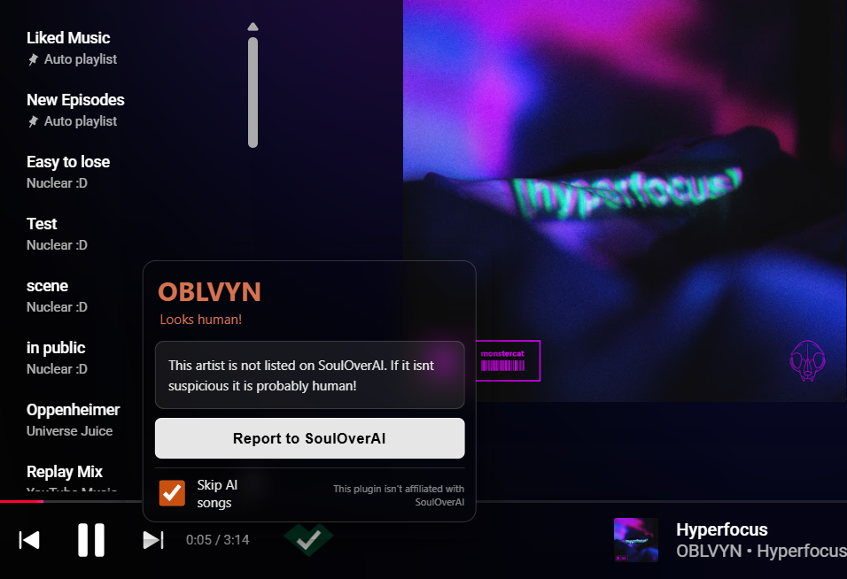
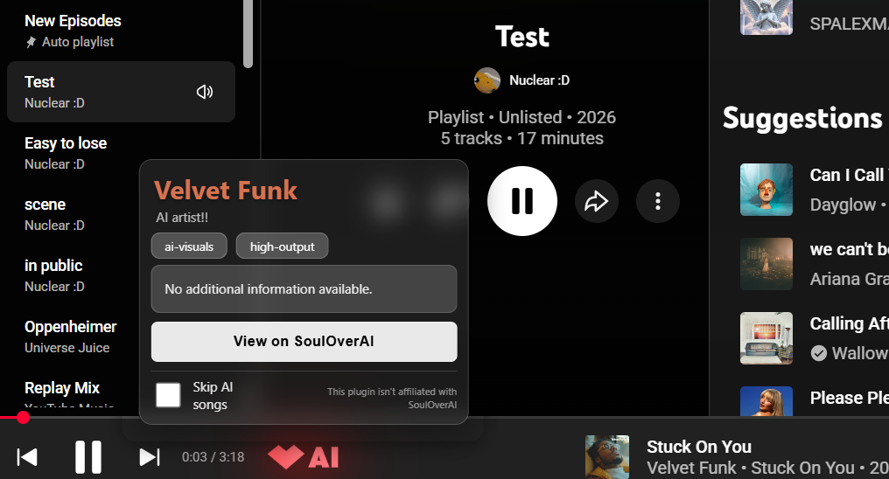

# Check [SoulOverAi](https://souloverai.com/list) automatically 

A bare-bones Chrome extension that watches YouTube Music and tells you whether the song you’re listening to was made by a human or a data center.

It automatically checks the current track against SoulOverAI's list

Very basic right now, much to be improved!

Messy code made by hand!... because having AI make it would go against the whole point wouldnt it?

